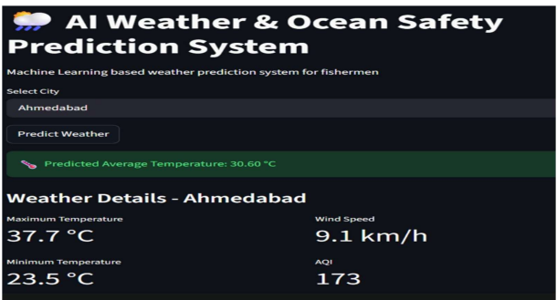

# AQI Prediction System

## Overview

The AQI Prediction System is a Machine Learning project designed to analyze environmental parameters and predict Air Quality Index (AQI) levels.

The system performs data preprocessing, feature engineering, predictive modeling, and visualization to help monitor pollution trends and improve environmental decision-making.

## Features

- Air Quality Data Analysis
- Data Cleaning and Preprocessing
- Feature Engineering
- AQI Prediction using Machine Learning
- Trend Visualization
- Environmental Monitoring Dashboard

## Technologies Used

- Python
- Pandas
- NumPy
- Matplotlib
- Scikit-Learn

## Methodology

1. Data Collection
2. Data Cleaning
3. Feature Selection
4. Model Training
5. Model Evaluation
6. AQI Prediction
7. Data Visualization

## Dataset

A publicly available Kaggle air quality dataset was used during model development and testing. The dataset file is not available in the current repository.

## Future Improvements

- Real-time AQI Monitoring
- IoT Sensor Integration
- Deep Learning Models
- Web Dashboard Deployment
## Screenshots

### Dashboard

## Author

Abhay Surya R
